# Product Stock Movement Report

This module provides the **Product Movement Valuation** wizard under Inventory reporting, with PDF and XLSX outputs.

## UI Evidence Screenshots

All screenshots are stored in `src/screenshots`.

### Navigation

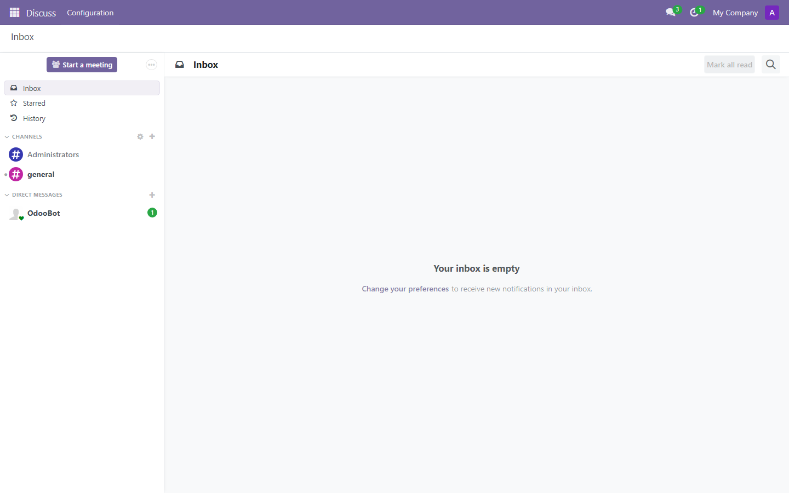
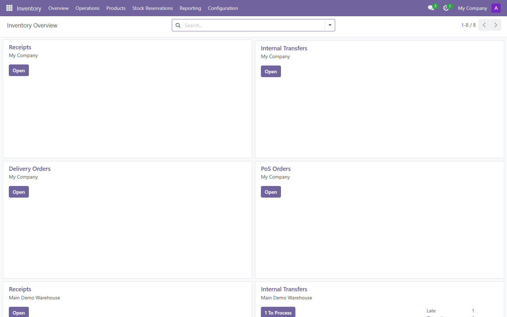

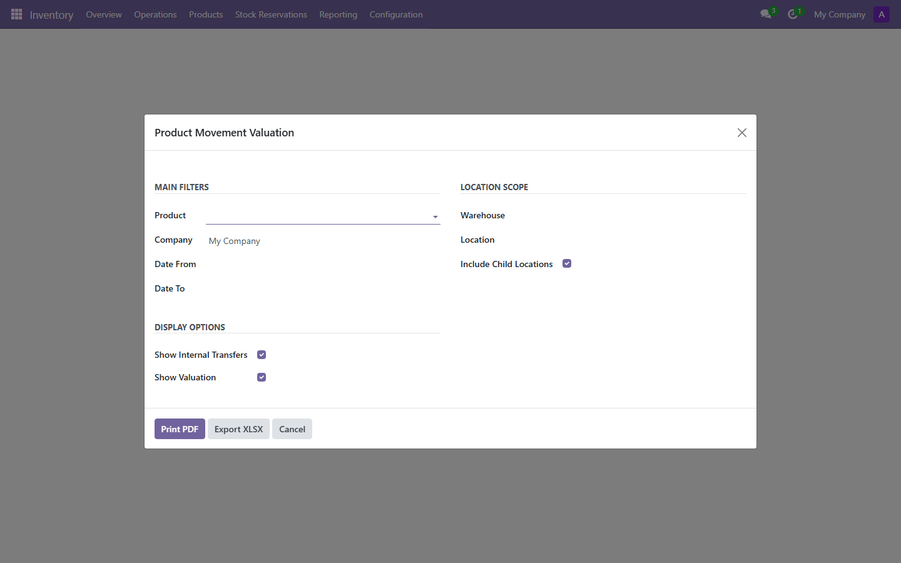

### Scenario 01

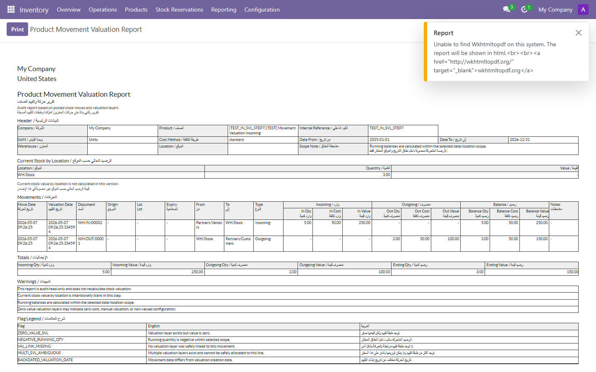
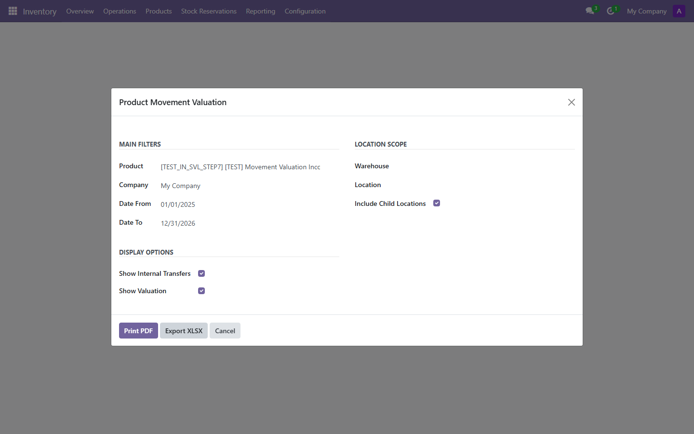
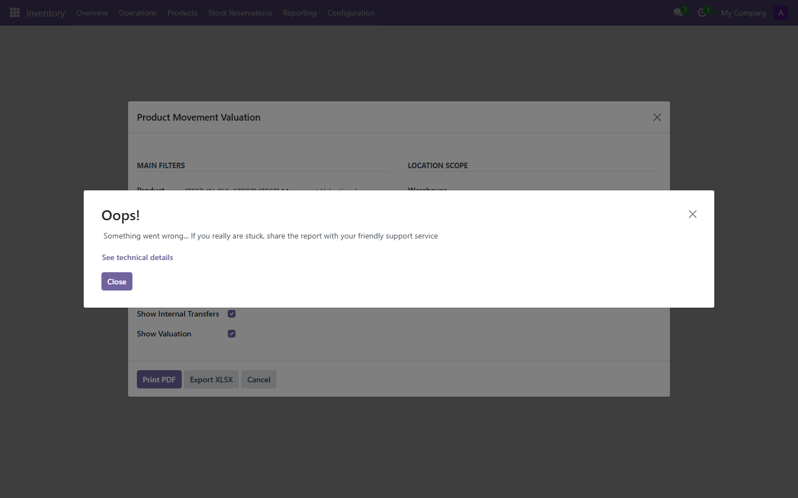

### Scenario 02

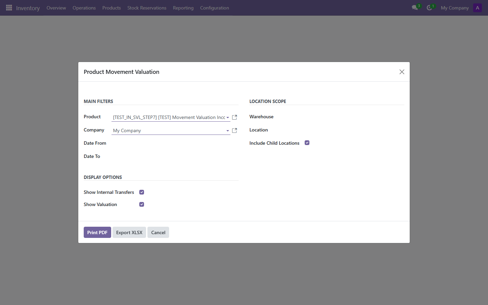

### Scenario 03
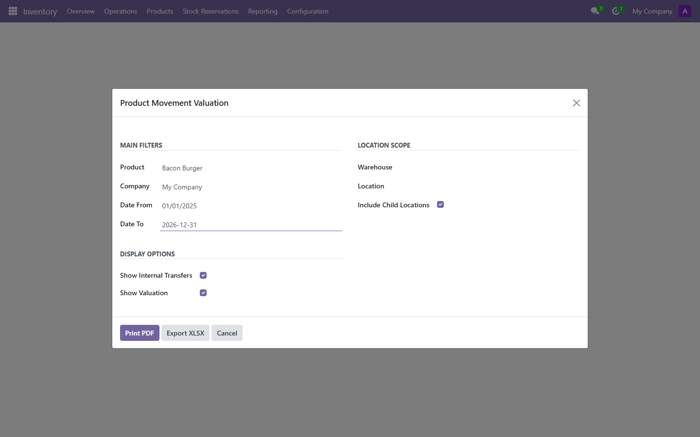
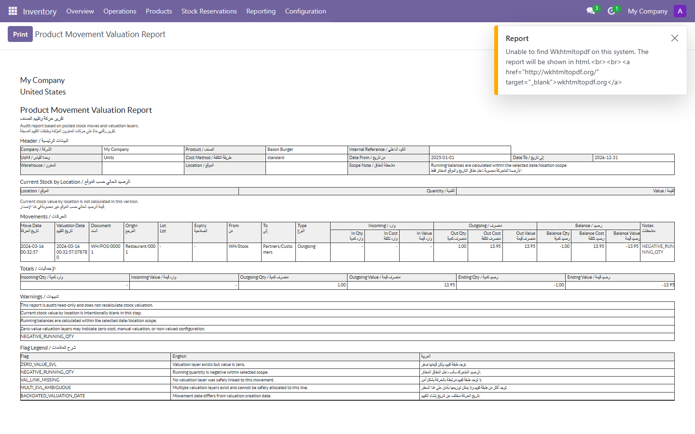
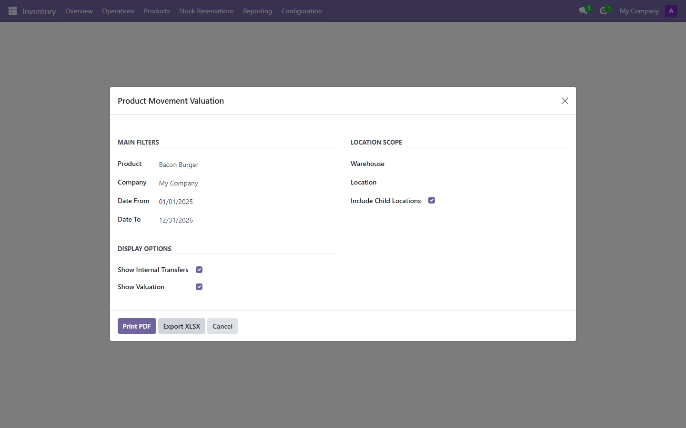
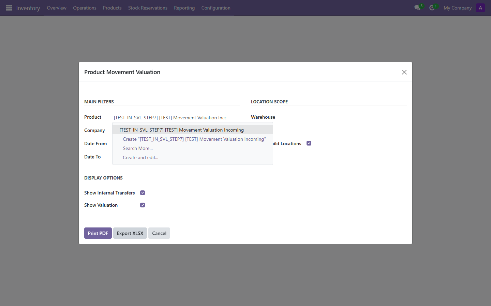

### Scenario 04
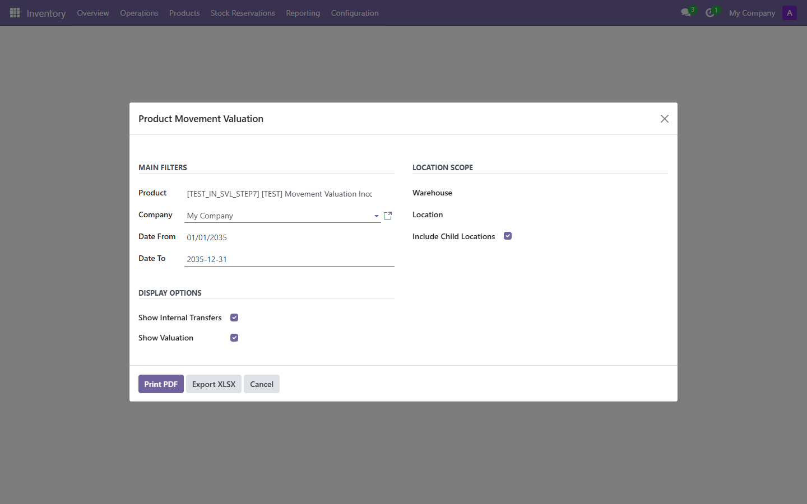
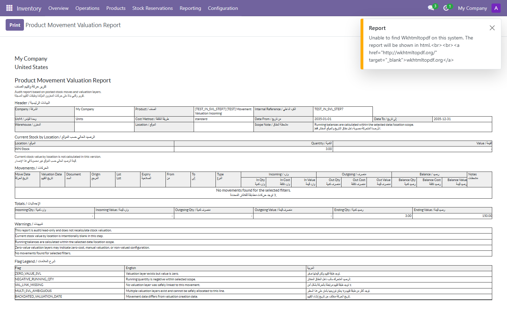

### Scenario 05

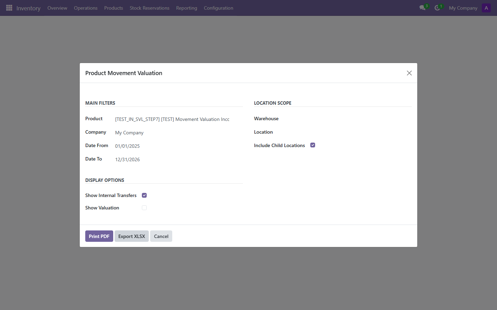

### Scenario 06 and 07
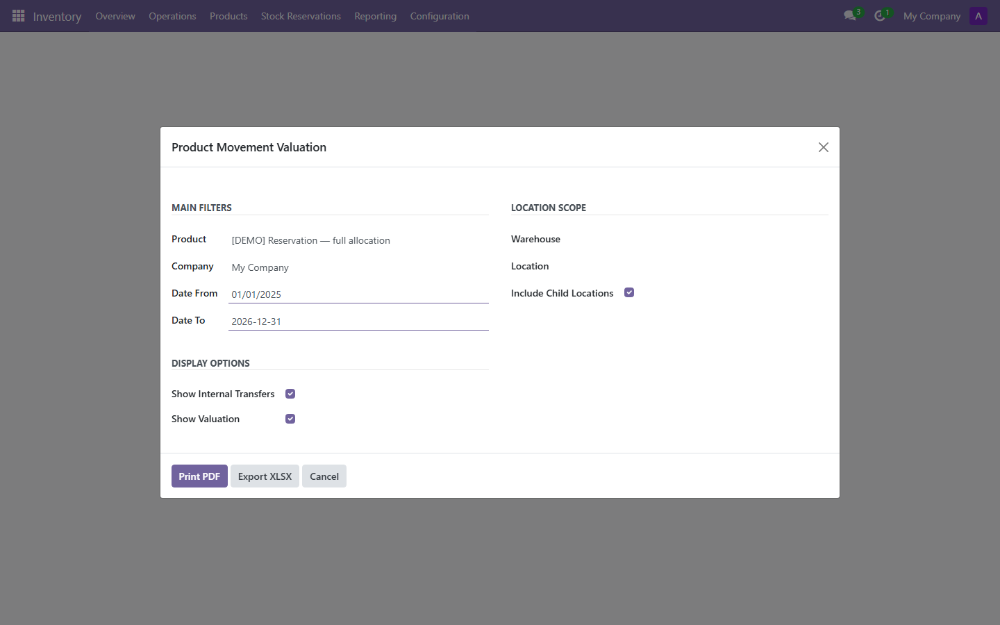

